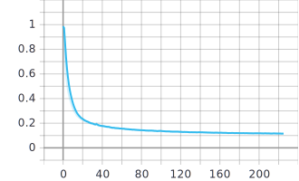

# MASR 中文语音识别

**MASR**是一个基于**端到端的深度神经网络**的**中文普通话语音识别**项目。

## 原理

MASR使用的是门控卷积神经网络（Gated Convolutional Network），网络结构类似于Facebook在2016年提出的Wav2letter。但是使用的激活函数不是`ReLU`或者是`HardTanh`，而是`GLU`（门控线性单元）。因此称作门控卷积网络。根据我的实验，使用`GLU`的收敛速度比`HardTanh`要快。如果你想要研究卷积网络用于语音识别的效果，这个项目可以作为一个参考。

**以下用字错误率CER来衡量模型的表现，CER = 编辑距离 / 句子长度，越低越好**

**大致可以理解为 1 - CER 就是识别准确率。**

模型使用AISHELL-1数据集训练，共150小时的录音，覆盖了4000多个汉字。**工业界使用的语音识别系统通常使用至少10倍于本项目的录音数据来训练，同时使用特定场景的语料来训练语言模型**，所以，不要期待本项目可以和工业界的识别效果媲美。这对于Github上任何个人项目来说都不现实，除非有更先进的技术诞生。

*什么叫特定场景的语料训练的语言模型？比如你使用游戏中的语音识别，它更倾向于将你的话识别成你在玩游戏时可能说的话，比如「貂蝉被蓝打死了」。而在其他场景下，「貂蝉被蓝打死了」根本就不是一句通顺的话。不信你和一个只读过三国演义没玩过王者荣耀的人说「貂蝉被蓝打死了」，你确定ta不会反问你：「啥？貂蝉被谁打死了？lan是谁？」*

在单卡GTX 1080Ti上，模型每迭代一个epoch大约需要20分钟。（实验室的CUDA版本较低，不排除更新CUDA版本后会快一些的可能。）

上图为验证集的CER随epoch的训练曲线。可以看到，目前验证集CER已经下降到11%。

图中没有显示测试集的表现。测试集的CER稍高一些，在14%。

通过外接语言模型可以将测试集的CER降低到8%。

项目目前提供的预训练模型训练了大约是100个epoch时候的，已经接近最好了。