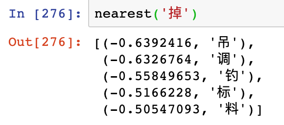

# 使用声学嵌入寻找音近字

你可能听说过**词嵌入**（word embedding）。作为神经语言模型的底层，词嵌入可以将词映射到一个低维连续空间中，并且使意思相近或相关的词有着较近的cosine距离，通过比较这个距离，可以找出一个词的近义词。

我们使用类似的思想将汉字嵌入到一个（较）低维的连续空间中，并使读音相近的汉字有着相近的cosine距离，并根据cosine距离来寻找音近字。如图，我们找到了嵌入空间中离「掉」最近的5个字，它们的读音也确实与「掉」接近。



## 使用MASR获取声学嵌入

**我们需要重新训练一个模型吗？**

**不需要！**

使用MASR的预训练模型，我们就能构造出这样一个声学嵌入（acoustic embedding）来。

在MASR的输出层有4334个单元，分别表示4333个汉字（严格地说不完全是汉字）和1个CTC的特殊标记。

在输出层之前有一个隐藏层，包含1000个单元。

连接他们的是一个$4334 \times 1000$的矩阵$W_{ij}$，对于第$i$个汉字，使用向量$W_i$作为它的嵌入向量即可。

为什么可以这么做呢？我先不说，留给你来思考～

使用声学嵌入给了我们直观判断一个声学模型是否合理的方式，你会发现，大多数情况下，MASR的预训练模型给出的音近字都是较为准确的。

## 自己试试

执行以下文件，多试几个汉字，看准不准。

```sh
python examples/embedding.py
```

